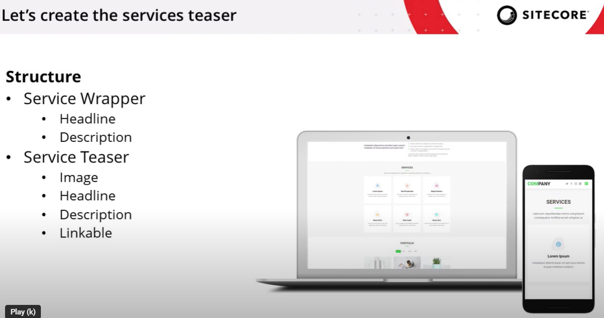
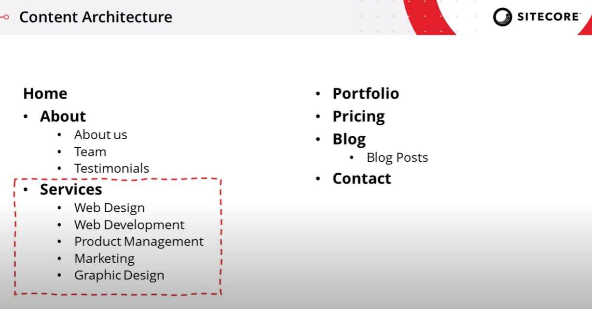

# Creating a Services Teaser Component in Sitecore SXA
*A Step-by-Step Guide Based on the Transcript*

In article walks through building a Services Teaser component—a key feature for a company homepage that highlights the services offered. The component includes an overall headline and description, plus a series of teaser tiles. Each tile displays an image, a sub-headline, a brief description, and is fully linkable to a service detail page. The following guide outlines the process, covering design, template creation, module setup, rendering cloning, and final integration using the Experience Editor.

---

## 1. Overview and Design Considerations

Before you begin, note that the Services Teaser is intended to:
- **Display an Overall Headline and Description:** These introduce the services area.
- **Show Teaser Tiles for Sub-Pages:** Each tile (often shown inside a red box, as per the design) contains an image, a headline, a description, and acts as a clickable link.
- **Adapt to Mobile:** On mobile devices, the overall headline/description remains at the top, with the individual service teasers stacked underneath.

The design aims to give visitors an at-a-glance view of the company’s services and provide direct navigation to detailed service pages.

---

## 2. Creating Page Templates for Services

Since the Services Teaser will reference multiple service detail pages, you must first set up the appropriate page templates.

### 2.1 Create the Overview and Detail Templates
1. **Navigate to Your SXA Tutorial Tenant:**
   In the Content Editor, go to the Templates folder under your SXA Tutorial project.
2. **Create a Services Overview Page Template:**
   - Use the standard page template provided by SXA as your base. This inheritance gives you out-of-the-box editing, design, meta tagging, and page design mapping.
3. **Create a Service Details Page Template:**
   - Again, inherit from the standard page template.
   - Add fields specific to the service detail page:
     - **Teaser Headline:** (Single-line text)
     - **Teaser Description:** (Multi-line text)
     - **Teaser Image:** (Image field)
       *Tip:* Limit the image field’s source to your site’s media library using query tokens (for example, using a token like `query:$siteMedia`).

4. **Assign Standard Values:**
   - Configure standard values for insert options, ensuring that new pages based on these templates automatically use the correct settings.

*By inheriting from the existing SXA page templates, you ensure that any future SXA upgrades benefit your pages as well.*

---

## 3. Creating a Module for the Services Feature

Modules help you scaffold all required items consistently and can be installed later on any site.

### 3.1 Setting Up the Services Module
1. **Navigate to System > Settings > Feature:**
   Within your SXA Tutorial tenant, create a new solution folder (for example, “SXA Tutorial”) if it doesn’t already exist.
2. **Insert a New Module:**
   - Use the insert option under the Feature node.
   - Name your module (e.g., “Services Module”).
   - Choose to install the module on site setup rather than tenant setup (unless you plan to share the feature across multiple tenants).
   - Select which folders to pre-create (such as Renderings, Placeholder Settings, Layouts, and Media Library folders).
3. **Confirm Module Creation:**
   - The new module will be organized under your solution folder and will later hold the rendering items and related templates for the Services feature.

---

## 4. Creating the Rendering by Cloning an Existing Component

Rather than starting from scratch, the presenter demonstrates cloning an existing component that closely matches the desired behavior—in this case, the Promo component.

### 4.1 Cloning the Promo Component
1. **Locate the Promo Component:**
   In the Renderings folder, find the Promo component, which has a data source behavior similar to what you need.
2. **Clone the Component:**
   - Right-click the Promo component and select the “Clone Rendering” script.
   - In the wizard, provide a new name (e.g., “Services”) and a CSS class (e.g., “services”) to help identify and style the component.
   - Select your newly created Services Module as the destination, so all cloned items are organized correctly.

### 4.2 Adjusting Rendering Parameters
- **Rendering Parameters:**
  - You have the option to inherit the existing parameters from Promo or create a copy.
  - For clarity, create a copy so that you can remove unnecessary fields that might confuse content authors.
- **View File:**
  - Decide whether to use the original Promo MVC view or create a new one. In this case, clone the Promo view and rename it (for example, “ServicesView.cshtml”).

### 4.3 Set the Data Source Location
- Configure the data source location to point to a “Services Folder” under your site’s data folder. This ensures that each instance of the Services Teaser component gets its own dedicated data source item.

---

## 5. Configuring the Rendering Variant

The rendering variant defines the component’s markup and structure.

### 5.1 Creating the Variant Definition
1. **Locate the Rendering Variants Folder:**
   Under Presentation > Rendering Variants, find the branch templates created during your module setup.
2. **Create or Edit the Default Services Variant:**
   - Remove any unnecessary elements (such as promo icons) that do not apply.
   - Add field renderers for:
     - **Services Headline:** Mapping to the corresponding field in your data source.
     - **Services Description:** Similarly mapped.
3. **Configure the Reference Renderer:**
   - Add a reference renderer that maps to a multi-list field (in your Services template) which references the Service Detail pages.
   - Optionally, set limits (e.g., maximum number of referenced items) so that only a defined number of service teasers are displayed.
4. **Wrap Each Tile in a Link:**
   - Use a section renderer with an “isLink” property to ensure that the entire tile (the combination of headline, description, and image) becomes clickable, navigating to the service detail page.

*This variant ensures that both the overall Services Teaser and each individual service tile are rendered according to your design.*

---

## 6. Finalizing and Installing the Feature

### 6.1 Verifying Module Installation
1. **Check in System Settings:**
   - Under System > Settings > Feature, verify that the Services Module is complete.
   - Ensure that available renderings, data source folders, and rendering variants have been created.
2. **Toolbox Setup:**
   - Confirm that the new “Services” component appears in the SXA Toolbox for authors.

### 6.2 Creating Pages and Mapping Page Designs
1. **Create a Services Overview Page:**
   - Using your new Services Overview page template, create a new page (e.g., “Services”).
2. **Create Service Detail Pages:**
   - Create one or more Service Detail pages based on your Service Details page template.
3. **Map Page Designs:**
   - In the Presentation settings (or via the Experience Editor’s page design mapping feature), assign an appropriate page design (such as the default page design that includes header, footer, and metadata).
   - This mapping ensures that the pages inherit common styling and layout features from your SXA environment.

### 6.3 Adding the Services Teaser Component to the Page
1. **Open the Overview Page in the Experience Editor:**
   - Drag the Services Teaser component from the Toolbox onto the page.
2. **Create a Data Source:**
   - When prompted, create a new data source item (e.g., “Services Teaser – [Your Page Name]”) under the Services Folder.
3. **Populate Content:**
   - Fill in the overall Services Headline and Description.
   - Use the multi-list field to reference the Service Detail pages.
4. **Review the Result:**
   - Verify that the teaser displays correctly, with service tiles showing the correct headlines, descriptions, and images.
   - Check on mobile to ensure that the overall component and individual teasers stack appropriately.

---

## 7. Conclusion

By following this transcript-based guide, you have successfully created a custom Services Teaser component in Sitecore SXA. Key steps included:
- **Designing and creating page templates** for both overview and detail pages that inherit from the standard SXA page template.
- **Setting up a dedicated module** to scaffold all necessary items.
- **Cloning an existing Promo component** to serve as a base for your Services Teaser, then modifying its rendering parameters and view.
- **Configuring a rendering variant** to output the required markup and reference service detail pages.
- **Installing the module and adding the component** to your site through the Experience Editor.

This setup not only streamlines the creation of service-related pages but also provides a robust, reusable component that adapts across devices and simplifies content authoring in Sitecore SXA.

---

*Note:* Replace placeholder images and query tokens with your own assets and settings to align the solution with your specific project environment.